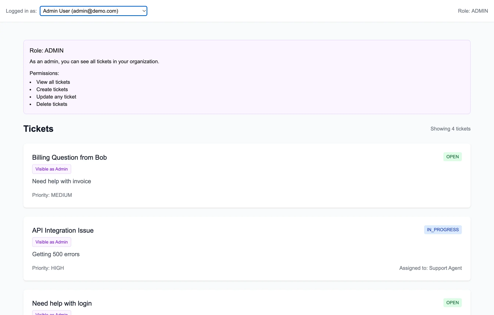
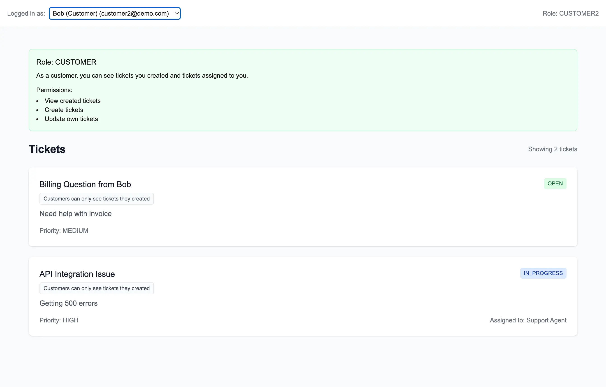

# Row-level access control with WorkOS FGA and Postgres


This example application demonstrates how to implement row-level security in a Next.js support ticketing application using [WorkOS FGA (Fine-Grained Authorization)](https://workos.com/fine-grained-authorization) and Postgres. 

It showcases a simple ticket management system where users have different roles (admin, agent, customer) and permissions are enforced at the row level.

For example, admins can view all tickets...



but customers can only view tickets they created... 



and support agents can only view tickets they are assigned and those within their organization.

## Overview

The application demonstrates two common patterns for implementing row-level security:

1. **Pre-filtering (Recommended)**: Query WorkOS FGA first to get a list of resource IDs the user has access to, then use these IDs in your SQL WHERE clause.
2. **Post-filtering**: Run your SQL query first, then filter the results based on FGA permissions.

### Pre-filtering Example (Used in this demo)

You can find this implementation in `app/api/tickets/route.ts`:

```typescript
// Query WorkOS FGA to get tickets the user can view 
const response = await workos.fga.query({
  q: `select ticket where user:${userId} is viewer`
});

// Map the response to an array of ticket IDs the user can view
const accessibleTicketIds = response.data.map(obj => obj.resourceId);

// Get tickets user can view
const tickets = await prisma.ticket.findMany({
  where: {
    id: { in: accessibleTicketIds }
  },
  include: {
    creator: true,
    assignee: true,
  }
});
```

Under the hood, this Prisma query boils down to the following SQL:

```sql
SELECT 
  t.*,
  creator.id as "creator_id",
  creator.name as "creator_name",
  creator.email as "creator_email",
  assignee.id as "assignee_id",
  assignee.name as "assignee_name",
  assignee.email as "assignee_email"
FROM "Ticket" t
LEFT JOIN "User" creator ON t.creator_id = creator.id
LEFT JOIN "User" assignee ON t.assignee_id = assignee.id
WHERE t.id IN ('ticket_id1', 'ticket_id2', /* ... allowed ids from FGA query */)
```

This demonstrates how FGA's authorization rules are ultimately enforced through a simple `WHERE IN` clause at the database level.

### Post-filtering Alternative

While not used in this demo, here's how you could implement post-filtering:

```typescript
// First, get all tickets
const tickets = await prisma.ticket.findMany({
  where: { /* your filters */ }
});

// Then check permissions for each ticket
const accessibleTickets = await Promise.all(
  tickets.map(async (ticket) => {
    const hasAccess = await checkPermission(userId, 'ticket', ticket.id, 'viewer');
    return hasAccess ? ticket : null;
  })
).then(tickets => tickets.filter(Boolean));
```

Pre-filtering is generally more efficient as it reduces the number of database queries and permission checks.

## Testing the Application

The repository includes API tests that demonstrate how the permission system works in practice. The tests verify that:

1. Admins can create, view, and delete tickets
2. Agents can view and update tickets
3. Customers can view tickets in their organization
4. Permission checks are enforced correctly

Run the tests with:
```bash
npm run test:api
```

The test output uses ✅ and ❌ indicators to clearly show which tests pass or fail:
```
✅ Loaded test users
✅ Created test ticket as admin
✅ Viewing ticket as Admin User
✅ Viewing ticket as Support Agent
✅ Viewing ticket as Alice (Customer)
✅ Updating ticket status as agent
✅ Listing filtered tickets as admin
✅ Deleting test ticket as admin

All tests completed!
```

For detailed response data and debugging, run the tests in debug mode:
```bash
DEBUG=true npm run test:api
```

## Features

- Role-based access control (Admin, Agent, Customer)
- Row-level security on tickets
- Permission inheritance (e.g., admins automatically get viewer access)
- Integration with Vercel Postgres

## Authorization Model

The FGA model defines the following types and relations:

```
type user

type ticket
    relation assignee [user]
    relation creator [user]
    relation parent [organization]
    relation viewer [user]

    inherit viewer if
        any_of
            relation creator
            relation assignee
            relation admin on parent [organization]
            relation agent on parent [organization]
            relation member on parent [organization]

type organization
    relation admin [user]
    relation agent [user]
    relation member [user]
```

This model establishes a hierarchical permission system where:
1. Users can be admins, agents, or members of an organization
2. Tickets belong to organizations (via the parent relation)
3. Users can view tickets if they:
   - Created the ticket
   - Are assigned to the ticket
   - Are an admin of the organization the ticket belongs to
   - Are an agent of the organization the ticket belongs to
   - Are a member of the organization the ticket belongs to

The FGA setup script (`npm run setup:fga`) creates this authorization model in your WorkOS account and establishes the initial relationships between users, organizations, and tickets. This is a crucial step as it defines the "rules" that WorkOS FGA will use to determine who can access what.

## Getting Started

1. Clone the repository:
   ```bash
   git clone https://github.com/yourusername/fga-row-level-security-postgres.git
   cd fga-row-level-security-postgres
   ```

2. Install dependencies:
   ```bash
   npm install
   ```

3. Set up your environment variables in `.env`:
   ```
   # WorkOS credentials (get these from https://dashboard.workos.com/get-started)
   WORKOS_API_KEY=your_api_key
   WORKOS_CLIENT_ID=your_client_id

   # Database URLs (Vercel Postgres)
   POSTGRES_URL=your_postgres_url
   POSTGRES_PRISMA_URL=your_prisma_url
   POSTGRES_URL_NON_POOLING=your_non_pooling_url
   ```

4. Set up the database and permissions (run these commands in order):
   ```bash
   # Push the database schema to your Postgres instance
   npx prisma db push

   # Seed the database with test organizations, users, and tickets
   npx prisma db seed

   # Set up FGA authorization model and initial permissions
   npm run setup:fga
   ```

5. Verify the setup by running the API tests:
   ```bash
   npm run test:api
   ```
   You should see a series of ✅ checks indicating that all permissions are working correctly. For detailed test output, run:
   ```bash
   DEBUG=true npm run test:api
   ```

6. Start the development server:
   ```bash
   npm run dev
   ```

The application will be available at http://localhost:3000. You can switch between different user roles (Admin, Agent, Customer) to see how permissions affect what each user can see and do.

## Learn More

- [WorkOS FGA Documentation](https://workos.com/docs/fga)
- [Next.js Documentation](https://nextjs.org/docs)
- [Prisma Documentation](https://www.prisma.io/docs)

## License

MIT
